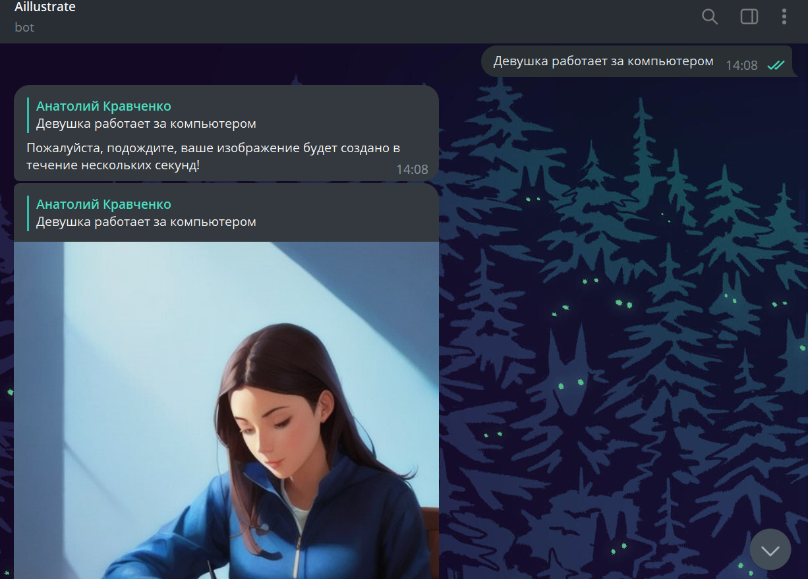
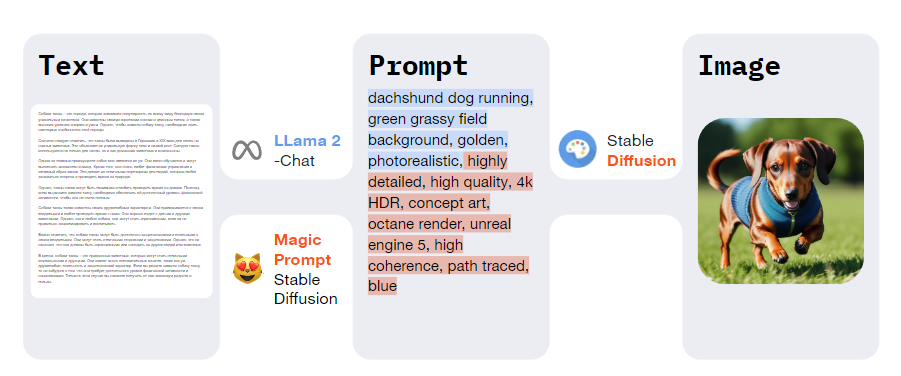

# 🤖🎨aillustrate
Aillustrate generates images for your texts.  
No prompt engineering needed: just pass your text (up to 3874 tokens) and get an illustration for it!


### Deployed Demo Link:
t.me/Aillustratebot



## Pipeline


## How To Deploy

### 1. Clone repo to server
```
foo@bar:~$ git clone https://github.com/anna-marshalova/aillustrate.git
```

### 2. Install requirements.txt
```
foo@bar:~$ pip3 install -r requirements.txt
```

### 3. Run application from root folder Aillustrate
```
foo@bar:~$ python3 main.py 
```
